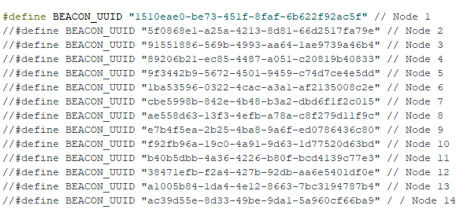
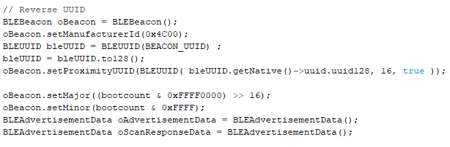
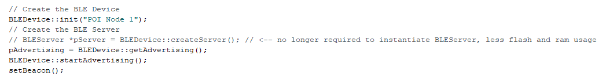
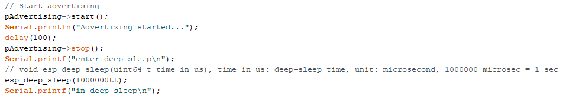

# Setting up ESP32 baord with Arduino IDE

- Open up _'BLE_iBeacon_Edited.ino'_ using Arduino IDE

## Setting up Beacon UUID

In this line of code, it sets the Beacon UUID which can be generated using a UUID generator website, https://www.uuidgenerator.net/

## Configuring Beacon Data

In these lines of code, we set the beacon's manufacturing ID to 0x4C00 which is Applie's manufacturing ID.

## Setting up Beacon UUID

In these lines of code, we can set the Beacon name when initializing the beacon.

## Setting up Beacon UUID

In these lines of code, we can set the packet broadcasting interval using esp_deep_sleep. The argument takes in time microseconds.

## Upload to ESP32 Board

Once you are done with configuration, you can upload this sketch into the ESP32 board.
