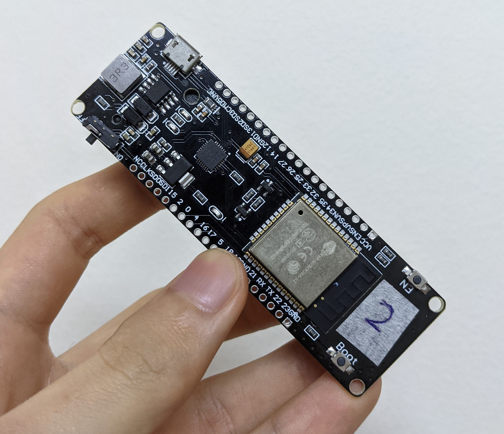
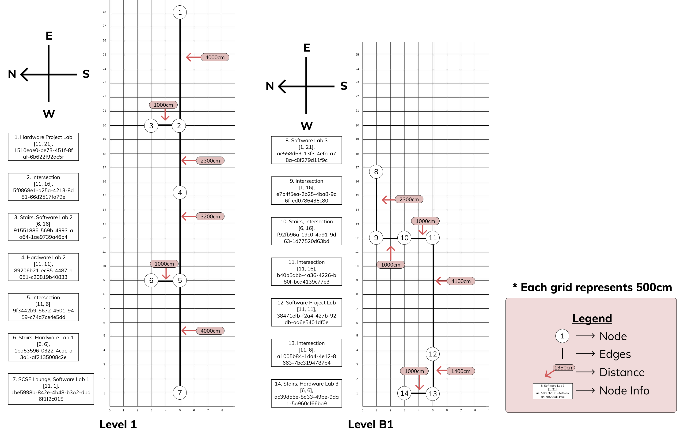
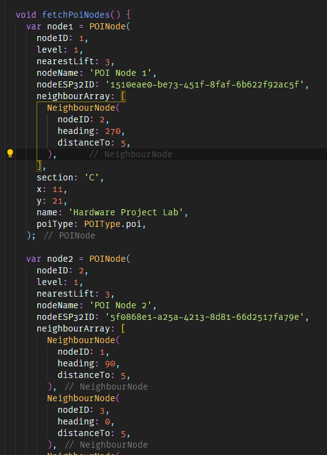

# NTU Final Year Project: SCSE20-0274, Development of iBeacon Application

## Pathfinder

<p align="center">

</p>

<iframe width="560" height="315" src="https://www.youtube.com/embed/DAWCtcEs20o" title="YouTube video player" frameborder="0" allow="accelerometer; autoplay; clipboard-write; encrypted-media; gyroscope; picture-in-picture" allowfullscreen>
</iframe>

# Project Objective

This project aims to provide an intuitive solution to indoor localization and indoor navigation. ESP32 boards were configured to be beacons using the iBeacon protocol. These beacons were placed in specific Point of Interest (POI) in SCSE, mainly near entrances of laboratories. A mobile app, Pathfinder, was developed to receive advertisement packets broadcasted by the beacons. These packets could be used to find out how far a user is to a beacon by using the RSSI in the packet. By placing a network of beacons in SCSE, we were able to navigate the user from any POI to a destination POI the user selected using Pathfinder by literally pointing them in the right direction.

# ESP32 Board

<p align="center">

</p>

For our project, we decided to use an ESP32 board. This is because it has in-built Wi-Fi and Bluetooth. It is also affordable. We are able to use Arduino IDE to configure this board into a beacon using the iBeacon protocol. To power these boards, we needed 18650 Li-Ion batteries. In actual scenario, these beacons would be placed at the ceiling in the area outside of the entrance of laboratories. This will ensure the advertisement packets would be spread our evenly.

The code to configure the ESP32 board can be found in '_./Arduino Code/BLE_iBeacon_Edited.ino_'.

# Screenshots of Pathfinder

<p align="center">

</p>

<p align="center">

</p>

# Pathfinding Algorithm

As we need to navigate the user to their destination, we need to find the fastest path. However, we also allow our user to navigate between levels. Thus, we created a modified version of the A\* algorithm that allows for multi-level navigation. If the user wish to navigate to a destination in another level, the algorithm will guide the user to the nearest stairs/lift before continuing guiding the user to the destination.

The pseudocode for the multi-level A\* algorithm can be found below:

```pseudocode
BEGIN

IF currentNode.level != destinationNode.level:
    Destination is not on same level
    SET current destinationNode to a temp variable
    SET destinationNode to nearestLift

IF currentNode == destinationNode:
    We have reached the lift node

SET all nodes heuristic to 999999
ADD all nodes to priority queue

WHILE currentNode != destinationNode OR we have reached the lift:

    IF destination is not on same level and we have reached the lift:

        SET original destinationNode from temp variable
        ADD currentNode to expanded list
        REMOVE currentNode from priority queue
        SET currentNode to nextLevelLift node
        We are now on the same level as destination
    ELSE:
        FOR each neighbour in currentNode:
            IF neighbour not expanded yet:
                Update neighbour’s heuristic
                IF neighbour has not been visited OR previous distance to neighbour is longer than current distance to neighbour:
                    SET neighbour's fromNode to currentNode
                    UPDATE neighbour's distance to shorter distance
                Update neighbour's f-value

        ADD neighbour to expanded list
        REMOVE neighbour from priority queue
        SORT priority list based on f-value
        SET currentNode to first node in queue

        IF we are at the liftNode && destination not on same level:
            We have reached the lift

ADD destinationNode to expandedNode
WHILE destinationNode != startingNode:
    ADD destinationNode to pathArray
    SET destinationNode to destinationNode.fromNode
ADD startingNode to pathArray
REVERSE pathArray to get path from start to destination

END
```

# Setting Up

## Placement of Beacons

<p align="center">

</p>
The environment for this project is in SCSE. Please ensure that the beacons are placed near the nodes as seen in the image above. The beacons are physically tagged with a Node ID which corresponds to the Node ID in the image above.

## Pathfinder Application

This application is currenly only available for Android devices. The APK can be found in '_./build/app/outputs/flutter-apk/app.apk_'. You can install the APK directly to your Android smartphone and utilize the app for navigation. **TAKE NOTE**: Pathfinder can only work if you are near the beacons. If not, Pathfinder will not know where you are located.

# Configuring of Beacon Data

As of now, the beacon information are all stored in the application. These information can be found in '_./lib/controllers/beacon_controller.dart_'
Another way to retrieve beacon information could be via a server. This could allow us to dynamically update the beacons information instead of it being fixed as of right now.

<p align="center">

</p>

Each beacon is stored in a POINode model. The fetchPoiNodes() function sets up all the POINode models during initialization and store them in a map. In this model, it stored various important information such as:

- level - Level of POI
- nearestLift - From this POI, which POI has the nearest lift/stairs
- nodeESP32ID: UUID of beacon
- neighbourArray: An array that stores the neighbours of this POI. In this array, it stores a NeighbourNode object which contains information such as the heading (bearing based on compass) and distanceTo (metric used in modified A\* algorithm).
- section: Which section this POI is located
- x: x-axis location based on map created above.
- y: y-axis location based on map created above.
- name: Name of POI.
- poiType: Type of POI (POI, Intersection)

If you wish to make changes to the beacon data, you can do so in this function.
